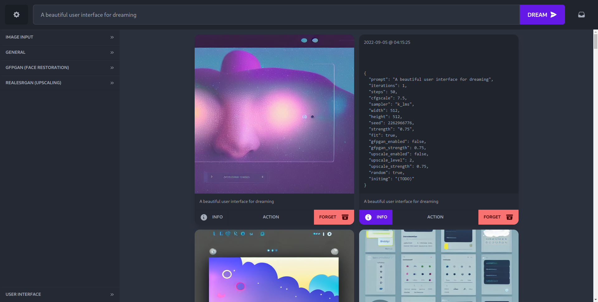

# Solid Diffusion

Minimalist web-based interface for Stable Diffusion with persistant storage in the browser, built with SolidJS.

(This project is a **__work-in-progress__** and is not feature complete. Come back later when it's done-er!)

  

## Features

* Dream queueing
* Persistent settings
* Persistent dream storage
* Multiple themes (thanks [daisyUI](https://daisyui.com)!)

### Planned features

* Settings UI controls
* Queue management (cancel queued or in-progress dreams)
* Image-to-image input with preview
* Reproduce settings from logged dreams
* Pipe dreams into image-to-image output
* Basic image editing
* Variants
* Inpainting?
* More...?

## Installation

### Prerequisites

Solid Diffusion is only a frontend, so it requires another piece of software to do the dreaming.

Currently, only the [lstein fork](https://github.com/lstein/stable-diffusion/) of Stable Diffusion is supported. 

You must **already have this configured and working** before you can set up Solid Diffusion.

### (Temporary) Setup  instructions

Because this project is very incomplete, builds aren't being provided yet.

If you would like to alpha-test (or help to build) Solid Diffusion, follow the setup instructions in the [contributing guide](./CONTRIBUTING.md).

Then, run `pnpm build`.

Then, copy the output from `dist/` into the `static/dream_web/` directory of your `stable-diffusion` folder.

## Contributing

Please see the [contributing guide](./CONTRIBUTING.md) for contributing information.
